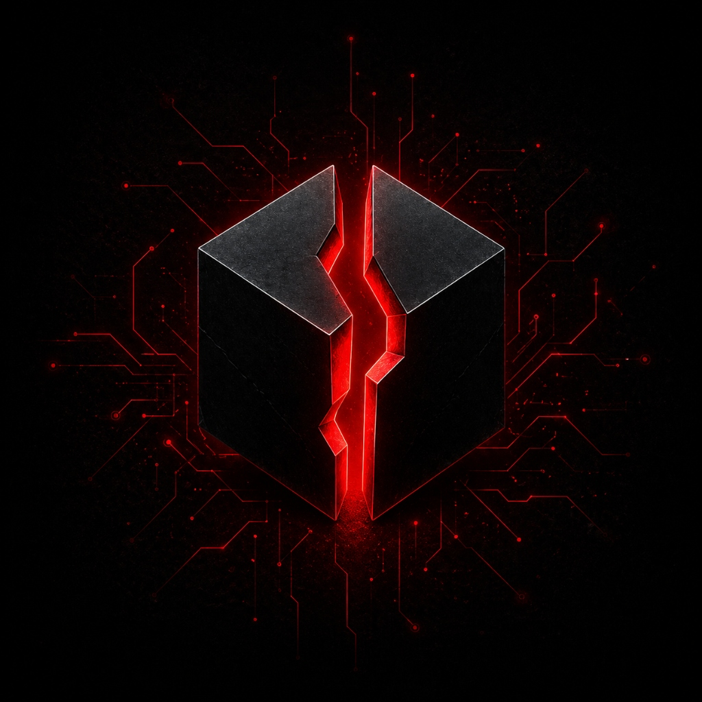
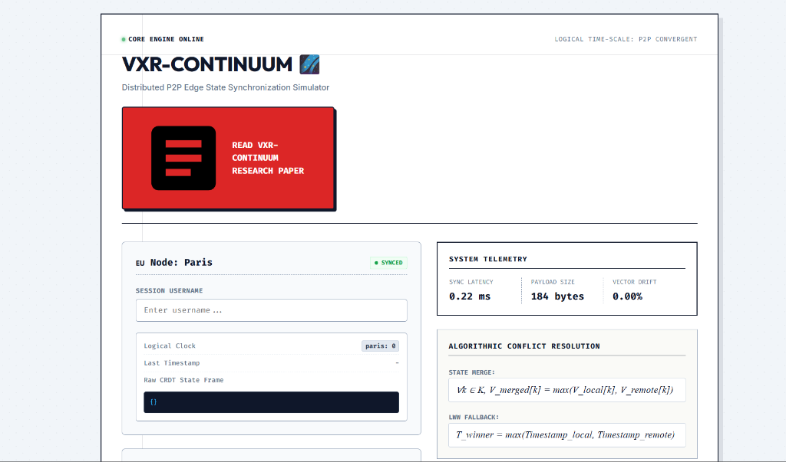
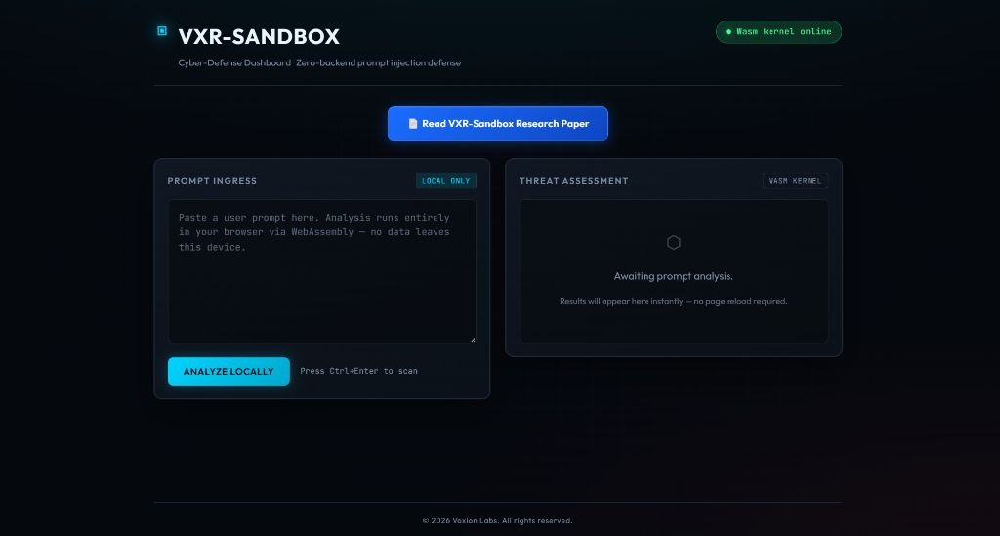
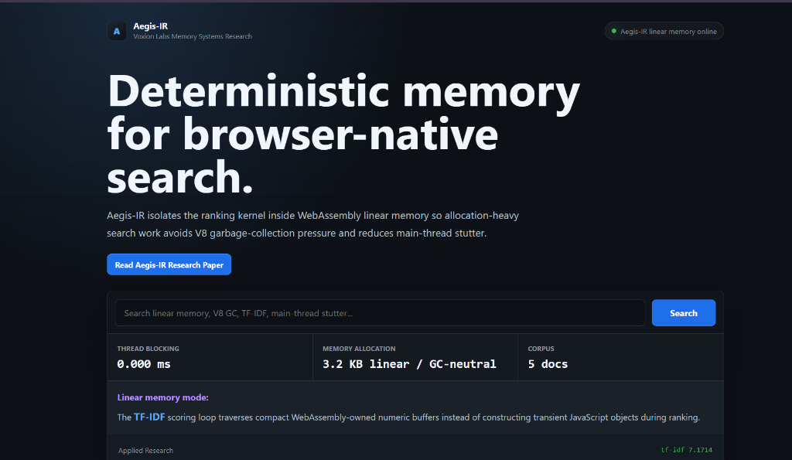

  

  Founder &amp; Lead Systems Researcher @ <b>Voxion Labs</b> ⚙️  
  Building intelligent systems, backend architectures &amp; experimental AI

<h3 align="center">AI/ML Explorer &nbsp;|&nbsp; Building Real-World Systems &nbsp;|&nbsp; Learning by Shipping</h3>

  

  
  
  
  

---

## 🧠 Professional Profile & Philosophy

I am **Rudranarayan Jena**, the **Founder and Lead Systems Researcher** at **Voxion Labs**. As a dedicated systems architect, aspiring data scientist, and AI engineer, my professional mission lies at the convergence of high-performance backend infrastructures, continuous learning models, and sandboxed developer operating environments.

Rather than simply building isolated applications, I design stateful architectures where software and machine intelligence co-evolve. My focus is on making high-performance sandboxes, multi-agent systems, and neural network pipelines more accessible and reliable for creators and developers worldwide. Through my dual role as **Founder and Researcher**, I actively transition raw theoretical computer science research into production-grade systems — learning by building, shipping, and optimizing.

---

## 🏢 Voxion Labs

  

**Voxion Labs** is an independent systems and artificial intelligence laboratory dedicated to research at the intersection of low-latency execution engines, stateful memory-driven AI agents, and sandboxed developer environments. Our core operating thesis is that future computing interfaces will not just run applications — they will co-evolve with the developers operating them.

🔗 **Explore our organizations:**

  ⚙️ <a href="https://github.com/Voxion-Labs"><b>Voxion Labs Organization</b></a> &nbsp;|&nbsp;
  🔬 <a href="https://github.com/liambrooks-lab"><b>Liam Brooks Lab</b></a>

---

### 🔬 Active Research Repositories

<table>
  <tr>
    <td width="48%" valign="top">
      
    </td>
    <td width="4%"></td>
    <td width="48%" valign="top">
      <h4>🌐 <a href="https://github.com/Voxion-Labs/VXR-Continuum">VXR-Continuum</a></h4>
      <b>Distributed P2P Edge State Synchronization Simulator</b>  
      A continuous state-persistence backplane and low-latency memory routing network. Uses CRDT-based algorithmic conflict resolution with 0.22ms sync latency and vector drift at 0.00% across P2P nodes — ensuring seamless multi-agent task continuity.
        
      <code>Python</code> &nbsp; <code>CRDT</code> &nbsp; <code>P2P</code> &nbsp; <code>Vector State</code>
    </td>
  </tr>
  <tr><td colspan="3"> </td></tr>
  <tr>
    <td width="48%" valign="top">
      
    </td>
    <td width="4%"></td>
    <td width="48%" valign="top">
      <h4>📦 <a href="https://github.com/Voxion-Labs/VXR-Sandbox">VXR-Sandbox</a></h4>
      <b>Cyber-Defense Dashboard · Zero-backend Prompt Injection Defense</b>  
      A high-security, browser-native prompt injection detection engine powered by a WebAssembly kernel. All analysis runs locally — no data leaves the device. Delivers real-time threat assessment results via an in-browser Wasm runtime without any page reloads.
        
      <code>WebAssembly</code> &nbsp; <code>JavaScript</code> &nbsp; <code>Cyber-Defense</code> &nbsp; <code>Wasm Kernel</code>
    </td>
  </tr>
  <tr><td colspan="3"> </td></tr>
  <tr>
    <td width="48%" valign="top">
      
    </td>
    <td width="4%"></td>
    <td width="48%" valign="top">
      <h4>🛡️ <a href="https://github.com/Voxion-Labs/Aegis-IR">Aegis-IR</a></h4>
      <b>Deterministic Memory for Browser-Native Search</b>  
      Aegis-IR isolates the ranking kernel inside WebAssembly linear memory so allocation-heavy search avoids V8 garbage-collection pressure and reduces main-thread stutter. Operates at 0.000ms thread blocking with a GC-neutral 3.2 KB linear memory allocation across a 5-document corpus.
        
      <code>C++</code> &nbsp; <code>WebAssembly</code> &nbsp; <code>TF-IDF</code> &nbsp; <code>Linear Memory</code>
    </td>
  </tr>
</table>

---

## 🎓 Professional Network & Contact

- 💼 <a href="https://www.linkedin.com/in/mr-rudranarayan-jena-88845b2a9?utm_source=share_via&utm_content=profile&utm_medium=member_android"><b>Connect with me on LinkedIn</b></a>
- 📸 <a href="https://www.instagram.com/rudra_.ai_researcher?igsh=ems3MDZ3Zmo0dDN5"><b>Connect with me on Instagram</b></a>
- 🐦 <a href="https://x.com/LiamBrooks_2006"><b>Connect with me on X</b></a>

---

- 📧 <a href="mailto:rudrajena440@gmail.com"><b>Contact me through Gmail - 1</b></a>
- 📧 <a href="mailto:liambrooks140@gmail.com"><b>Contact me through Gmail - 2</b></a>

> 💡 *Always open to discussing ML architecture, full-stack opportunities, and collaborative AI projects.*

---

---

## 💎 Core Engineering Projects

> These are the foundational products designed, built, and shipped under the **Voxion Labs** umbrella.

### 💻 [VoidLAB](https://github.com/liambrooks-lab/VoidLAB) — Minimalist Browser Cloud IDE

<table>
  <tr>
    <td valign="top" width="38%">

| Field | Details |
| :--- | :--- |
| **Type** | Cloud IDE |
| **Status** | Active |
| **Stack** | React, Next.js, Web Workers |
| **Org** | liambrooks-lab |

  </td>
  <td valign="top" width="62%">
  A zero-latency, sandbox-isolated browser IDE for seamless cross-platform developer workflows. Features a multi-tab workspace, responsive file explorer, background compile threads via web workers, and multi-language execution — all operable from any device without installation.
  </td>
  </tr>
</table>

---

### ⚙️ [FluxKernel](https://github.com/liambrooks-lab/FluxKernel) — Memory-Driven AI OS Agent

<table>
  <tr>
    <td valign="top" width="38%">

| Field | Details |
| :--- | :--- |
| **Type** | AI Agent Kernel |
| **Status** | Active |
| **Stack** | Python, LangChain, Vector DB |
| **Org** | liambrooks-lab |

  </td>
  <td valign="top" width="62%">
  A persistent, memory-driven AI agent that operates directly on local filesystems. Routes tasks between cloud LLMs and local models using self-correcting git-diff patches, with a semantic vector memory backplane that maintains full context continuity across sessions.
  </td>
  </tr>
</table>

---

### 🌐 [HorizonSync](https://github.com/liambrooks-lab/HorizonSync) — Unified Collaborative Workspace

<table>
  <tr>
    <td valign="top" width="38%">

| Field | Details |
| :--- | :--- |
| **Type** | Collaboration Platform |
| **Status** | Active |
| **Stack** | TypeScript, Next.js, Socket.io |
| **Org** | liambrooks-lab |

  </td>
  <td valign="top" width="62%">
  A high-performance multi-user workspace with real-time state streaming, shared file trees, and concurrent terminal feeds. Optimized diff payloads and WebSocket frames keep synchronization latency under 15ms across all live sessions.
  </td>
  </tr>
</table>

---

### 🔊 [LEXIO](https://github.com/Voxion-Labs/LEXIO) — Premium Text-To-Speech Engine

<table>
  <tr>
    <td valign="top" width="38%">

| Field | Details |
| :--- | :--- |
| **Type** | TTS Web Application |
| **Status** | Active |
| **Stack** | JavaScript, Web Speech API |
| **Org** | Voxion-Labs |

  </td>
  <td valign="top" width="62%">
  A premium, real-time TTS engine with dynamic voice selection (male/female), regional accent modulation, and real-time sentence highlighting. Handles multi-format documents with low-latency segment parsing for seamless, clip-free audio streaming.
  </td>
  </tr>
</table>

---

### 🎓 [SkillNODE](https://github.com/liambrooks-lab/SkillNODE) — Social Skill Acquisition Platform

<table>
  <tr>
    <td valign="top" width="38%">

| Field | Details |
| :--- | :--- |
| **Type** | Skill-Dev Platform |
| **Status** | Active |
| **Stack** | Node.js, Socket.io, React, MongoDB |
| **Org** | liambrooks-lab |

  </td>
  <td valign="top" width="62%">
  A multi-page interactive platform combining rigorous programming practice, competitive live coding rooms, and AI-guided study tracks. Real-time multiplayer arenas let developers solve complex algorithm challenges in shared collaborative environments.
  </td>
  </tr>
</table>

---

### 🖥️ [RedTerminal](https://github.com/Voxion-Labs/RedTerminal) — C-Based OS Process Simulator

<table>
  <tr>
    <td valign="top" width="38%">

| Field | Details |
| :--- | :--- |
| **Type** | Systems Simulator + Web Demo |
| **Status** | Active |
| **Stack** | C11, POSIX Threads, Vanilla JS |
| **Org** | Voxion-Labs |
| **Live Demo** | [voxion-labs.github.io/RedTerminal](https://voxion-labs.github.io/RedTerminal/) |

  </td>
  <td valign="top" width="62%">
  A lightweight systems-level C project demonstrating OS fundamentals: process lifecycle management, CPU scheduling via POSIX threads, thread-safe async logging, and a striking Vanilla JS browser terminal emulator. Features a glassmorphism UI with OS-style boot sequences, real-time telemetry sidebar, and full command history — all with zero external dependencies.
  </td>
  </tr>
</table>

---

### 🚀 [ApexProtocol](https://github.com/liambrooks-lab/ApexProtocol) — Sci-Fi Survival Horror Game *(Upcoming)*

<table>
  <tr>
    <td valign="top" width="38%">

| Field | Details |
| :--- | :--- |
| **Type** | Sci-Fi Survival Horror Game |
| **Status** | 🔧 In Development |
| **Stack** | C#, C++ |
| **Org** | liambrooks-lab |

  </td>
  <td valign="top" width="62%">
  An upcoming, large-scale sci-fi survival horror experience built with C# and C++. ApexProtocol is among the most ambitious titles in the lab's game division — currently in active development with a focus on atmospheric world-building, survival mechanics, and performance-critical native rendering pipelines.
  </td>
  </tr>
</table>

<table align="center">
  <tr>
    <td align="center" width="100"> <b>Python</b></td>
    <td align="center" width="100"> <b>C++</b></td>
    <td align="center" width="100"> <b>JavaScript</b></td>
    <td align="center" width="100"> <b>TypeScript</b></td>
    <td align="center" width="100"> <b>React</b></td>
    <td align="center" width="100"> <b>Next.js</b></td>
  </tr>
  <tr>
    <td align="center" width="100"> <b>Node.js</b></td>
    <td align="center" width="100"> <b>Docker</b></td>
    <td align="center" width="100"> <b>TensorFlow</b></td>
    <td align="center" width="100"> <b>Git</b></td>
    <td align="center" width="100"> <b>PostgreSQL</b></td>
    <td align="center" width="100"> <b>WebAssembly</b></td>
  </tr>
</table>

---

## 🧪 Other Engineering Implementations

| Project | Stack | Description |
| :--- | :--- | :--- |
| 🔹 <a href="https://github.com/liambrooks-lab/VoidLAB-Beta">VoidLAB-Beta</a> | JS, HTML5, Web Workers | Initial experimental prototype of VoidLAB. Explored sandboxed client-side JS and Python execution models that seeded the full IDE design. |
| 🎮 <a href="https://github.com/liambrooks-lab/Point_Null">Point_Null</a> | Python, Pygame, Pygbag | A 2D top-down action-survival game set in a dark, corrupted environment. The player destroys incoming enemies, collects scrap, and spends it to build safe-zone nodes. Runs in-browser via Pygbag WebAssembly compilation. |
| 🎮 <a href="https://github.com/Voxion-Labs/Empty_Pointer">Empty_Pointer</a> | C++, Raylib, WebAssembly | A grid-based action-survival game built natively in C++ with the Raylib framework. Navigate the system, merge bit values, and evade Red-Code algorithms. Compiled directly to WebAssembly for zero-install browser play. |

---

## 📊 GitHub Metrics

  
  &nbsp;&nbsp;
  

  

---

## 🧠 Current Focus

- Machine Learning & AI Systems  
- Building scalable real-world applications  
- Strengthening DSA & problem-solving  

## 🧬 Vision

> I aim to build intelligent systems that **think, adapt, and evolve**

> Built under **Voxion Labs** ⚙️

  

