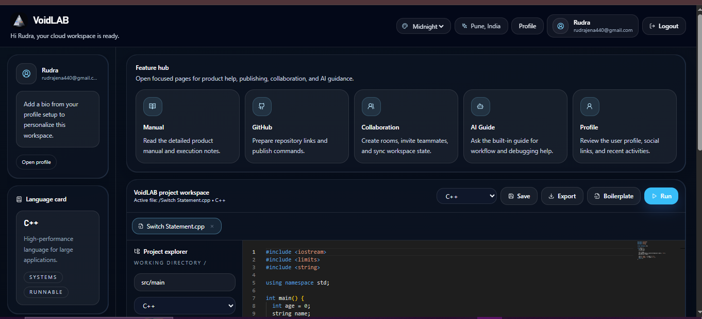
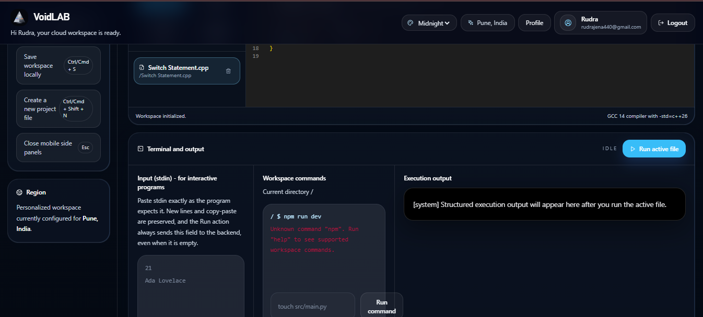
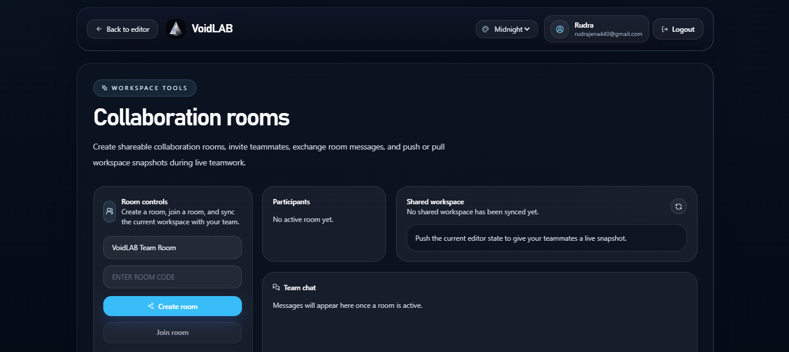
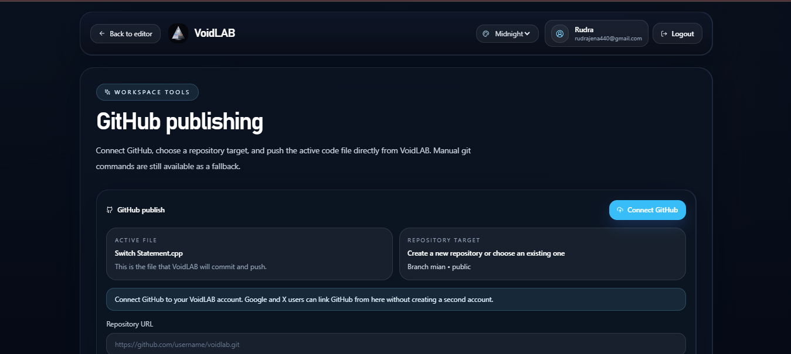
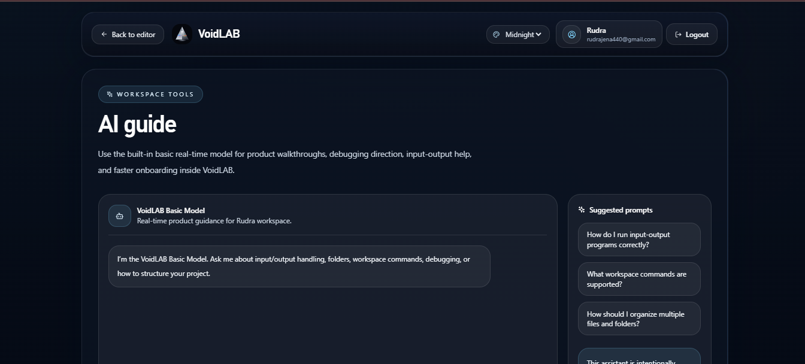

  

<h3 align="center">AI/ML Explorer | Biulding Real-World Systems | Learning by Shipping</h3>

  

  
  
  
  

  

## 🧠 About Me
- ⚡ Passionate about **AI, ML, and Data Science**
- ⚡ I do not just code - I **build systems that solve real problems**
- ⚡ Currently working on **AI tools, automation, and intelligent platforms**
- ⚡ Goal: Become a Top-Tier ML Engineer and Data Scientist

  

## 🎓 Education & Professional Network
- 🔗 <a href="https://www.linkedin.com/in/mr-rudranarayan-jena-88845b2a9?utm_source=share_via&utm_content=profile&utm_medium=member_android">**Connect with me on LinkedIn**</a>
- 🔗 <a href="https://www.instagram.com/ai_ds.expert_rudra?igsh=ems3MDZ3Zmo0dDN5">**Connect with me on Instagram**</a>
- 🔗 <a href="@LiamBrooks_2006">**Connect with me on X**</a>
---------
- 🔗 <a href="mailto:rudrajena440@gmail.com">**Contact me through Gmail - 1**</a>
- 🔗 <a href="mailto:liambrooks140@gmail.com">**Contact me through Gmail - 2**</a>

- 💡 *I am always open to discussing machine learning architecture, full-stack opportunities, and collaborative AI projects.*

  

## Tech Stack
 Tech I've worked with 

  

  

## 💻 VoidLAB Demo (Live Experience)

**Live Project:** [void-lab-web.vercel.app](https://void-lab-web.vercel.app/)

 VoidLAB is a browser-based cloud IDE built for coding, execution, workspace collaboration, GitHub publishing, and guided onboarding inside one modern interface.

<table>
  <tr>
    <td align="center" width="50%">
      
       
      <b>Editor workspace</b> - feature hub, language tools, and active coding surface.
    </td>
    <td align="center" width="50%">
      
       
      <b>Terminal workflow</b> - save, run, and inspect execution flow directly in the workspace.
    </td>
  </tr>
  <tr>
    <td align="center" width="50%">
      
       
      <b>Collaboration rooms</b> - shared rooms, team chat, and synchronized workspace snapshots.
    </td>
    <td align="center" width="50%">
      
       
      <b>GitHub publishing</b> - connect GitHub, target a repository, and push active work.
    </td>
  </tr>
  <tr>
    <td align="center" colspan="2">
      
       
      <b>AI guide</b> - built-in product help for onboarding, debugging direction, and workspace support.
    </td>
  </tr>
</table>

  

## 💎 Core Projects

### 💻 VoidLAB - Cloud IDE
🔗 <a href="https://github.com/liambrooks-lab/VoidLAB">View Project</a>  
> Full-featured browser IDE with multi-language execution  
⚡ Tabs • File explorer • Developer-first UX

  

### ⚙️ FluxKernel - AI Operating System Agent
🔗 <a href="https://github.com/liambrooks-lab/FluxKernel">View Project</a>  
> OS-level AI agent built for persistent memory, direct filesystem workflows, and premium developer control  
⚡ Persona engine • Diff approval • Secure workspace sandbox

  

### 🌐 HorizonSync - Unified Collaboration Workspace
🔗 <a href="https://github.com/liambrooks-lab/HorizonSync">View Project</a>  
> Productivity and synchronization workspace that combines team communication, publishing, and private execution in one platform  
⚡ Hubs • Global feed • My Space

  

### 🔊 LEXIO - TTS Engine
🔗 <a href="https://github.com/liambrooks-lab/LEXIO">View Project</a>  
> Real-time text-to-speech with voice customization  
⚡ Web Speech API • Document reader

  

### 🎯 SkillNODE - AI Learning Platform
🔗 <a href="https://github.com/liambrooks-lab/SkillNODE">View Project</a>  
> AI-powered skill development ecosystem  
⚡ Practice • Social • Intelligent learning

  

## 🧪 Other Projects
🔹 Zyron (forked)
- <a href="https://github.com/liambrooks-lab/Zyron">Click to View</a>

🔹 VoidLAB-Beta
- <a href="https://github.com/liambrooks-lab/VoidLAB-Beta">Click to View</a>

🔹 OOPs-Cpp
- <a href="https://github.com/liambrooks-lab/OOPs-Cpp">Click to View</a>

🔹 Solutions-LeetCode (forked)
- <a href="https://github.com/liambrooks-lab/Solutions-LeetCode">Click to View</a>

🔹 OpenAI-Skills (forked)
- <a href="https://github.com/liambrooks-lab/OpenAI-Skills">Click to View</a>

🔹 4-Stories
- <a href="https://github.com/liambrooks-lab/4-Stories">Click to View</a>

  

## 📊 Real-Time GitHub Stats & Activity

  

    

  <table>
    <tr>
      <td align="center">
        
      </td>
      <td align="center">
        
      </td>
    </tr>
  </table>

   

  

  

## 🧠 Current Focus
- Machine Learning & AI Systems
- Building scalable real-world applications
- Strengthening DSA & problem-solving

  

## 🧬 Vision
> I aim to build intelligent systems that **think, adapt, and evolve** - not just tools, but real AI solutions.

  

<h3 align="center">... I build projects that solve real problems and improve with every Iteration ...</h3>
---

  
  
  

  

