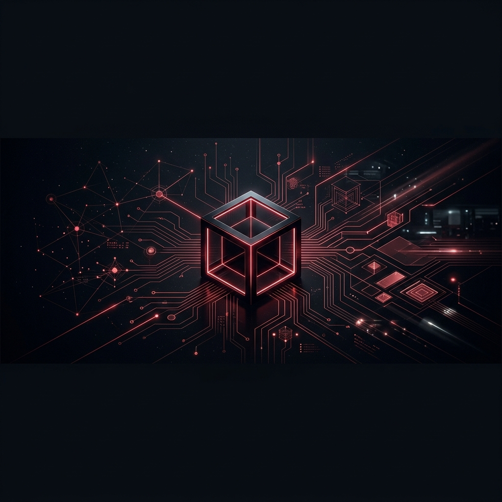
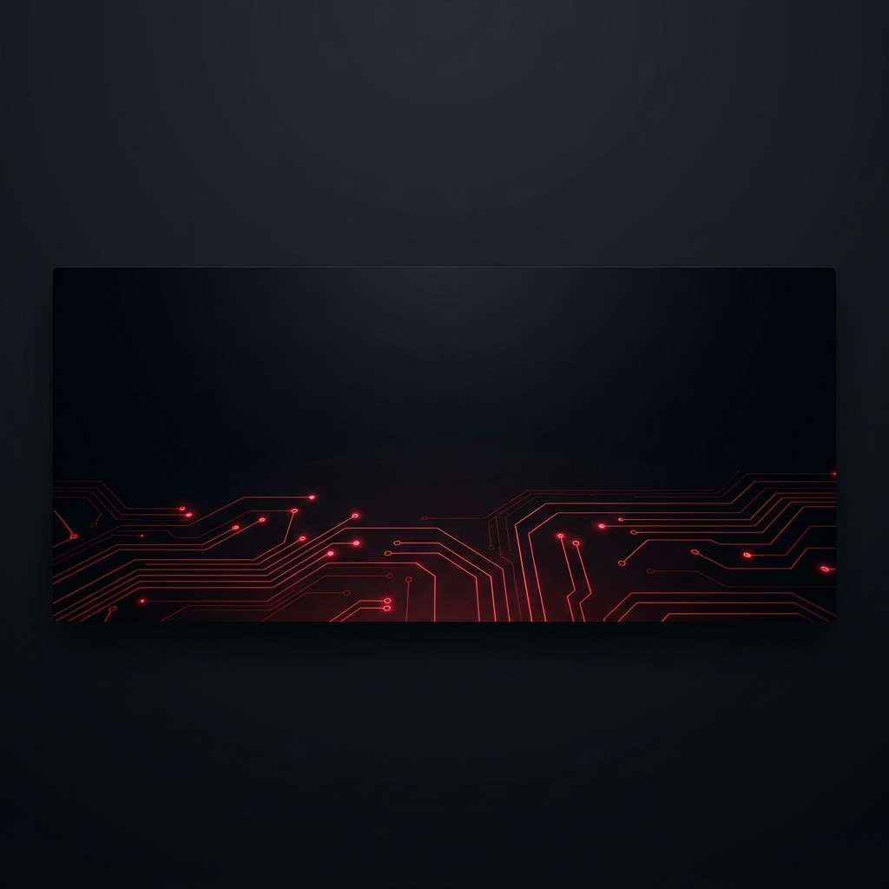

<p align="center">
  
</p>

<p align="center">
  
</p>

<p align="center">
  <a href="#-voxion-labs"></a>
  <a href="#-active-research"></a>
  <a href="#-active-research"></a>
  <a href="mailto:rudrajena440@gmail.com"></a>
</p>

<hr style="border: 0; height: 1px; background: linear-gradient(to right, rgba(225, 29, 72, 0), rgba(225, 29, 72, 0.75), rgba(225, 29, 72, 0)); margin: 20px 0;">

# ⚙️ Rudranarayan Jena
> **Founder & Lead Researcher @ Voxion Labs**  
> *Aspiring Data Scientist, ML Engineer, and Systems Builder obsessed with building stateful artificial intelligence, compiled sandbox environments, and persistent human-agent workspaces.*

---

## 🏢 Voxion Labs: Systems Research & Foundational Vision

**Voxion Labs** is an independent systems and artificial intelligence laboratory dedicated to research at the intersection of low-latency execution engines, stateful memory-driven AI agents, and sandboxed developer environments. Our core operating thesis is that future computing interfaces will not just run applications—they will co-evolve with the developers operating them.

### 🔬 Core Research Pillars

*   **Cognitive Agent Architectures:** Researching agent persistence, routing, and auto-corrective diff engines (e.g., *FluxKernel*).
*   **Isolated Web Runtimes:** Designing zero-latency cloud terminal compiler frameworks and virtual filesystems operating within browser sandboxes (e.g., *VoidLAB*).
*   **Collaborative Systems:** Engineering unified collaborative environments with real-time state synchronization for developer workspaces (e.g., *SkillNODE*, *HorizonSync*).

---

## 🧪 Engineering & Research Ecosystem

Here is a technical overview of the primary systems currently active or in experimental stages within the lab:

### 1. [FluxKernel](https://github.com/liambrooks-lab/FluxKernel) ⚙️ — Experimental AI OS Agent
A persistent, memory-driven kernel that operates directly on local filesystems. Facilitates task routing between local and cloud-based LLMs based on active agent profiles.
*   **Key Innovations:** Real-time terminal execution loop, self-correcting git-diff patching pipeline, and vector-based semantic memory persistent across system sessions.
*   **Stack:** Python • LangChain • Vector Databases • CLI Integrations.

### 2. [VoidLAB](https://github.com/liambrooks-lab/VoidLAB) 💻 — Minimalist Cloud IDE
A zero-latency, sandbox-isolated browser IDE designed for seamless cross-platform developer workflows.
*   **Key Innovations:** Dynamic multi-tab workspace, low-latency execution loop, web workers for background compile threads, and multi-language compiler integration.
*   **Stack:** React • Next.js • TailwindCSS • Isolated Web Runtimes • Execution APIs.

### 3. [SkillNODE](https://github.com/liambrooks-lab/SkillNODE) 🌐 — Social Skill-Building Network
An end-to-end skill acquisition and practice platform combining multi-category programming exercises, competitive rooms, and live community interaction.
*   **Key Innovations:** Live state synchronization, multi-user coding spaces utilizing Socket.io, and algorithmic skill analytics.
*   **Stack:** Node.js • Express • Socket.io • React • MongoDB.

### 4. [HorizonSync](https://github.com/liambrooks-lab/HorizonSync) & [Empty_Pointer](https://github.com/Voxion-Labs/Empty_Pointer) 🎮 — Productivity Sync & WebAssembly Engine
*   **HorizonSync:** A modern workspace orchestrator bringing multi-user real-time state streaming and unified terminal feeds into a single collaborative interface.
*   **Empty_Pointer:** A high-performance, grid-based survival game developed in C++ and compiled directly to WebAssembly to target native browser graphics execution speeds.

---

## 🛠️ Scientific & Systems Tech Stack

```
================================================================================
  LANGUAGES & SYSTEMS      :: Python | C++ | TypeScript | JavaScript | HTML5 | CSS3
  INFRASTRUCTURE & ENGINE  :: Docker | Node.js | Express.js | Linux | Socket.io
  AI & DATA SCIENCE        :: TensorFlow | Scikit-Learn | Pandas | NumPy | Git
================================================================================
```

---

## 📊 GitHub Systems Metrics

<p align="center">
  
  
</p>

---

## 📫 Terminal Directory & Networking

```bash
$ finger rudranarayan-jena

# CONTACT & NETWORK DIRECTORY:
- Primary Email  :: rudrajena440@gmail.com
- Alt Email      :: liambrooks140@gmail.com
- LinkedIn       :: linkedin.com/in/mr-rudranarayan-jena-88845b2a9
- Twitter / X    :: x.com/LiamBrooks_2006
- Instagram      :: instagram.com/rudra_.ai_researcher
- Lab Portals    :: github.com/Voxion-Labs | github.com/liambrooks-lab
```

---

<p align="center">
  
</p>